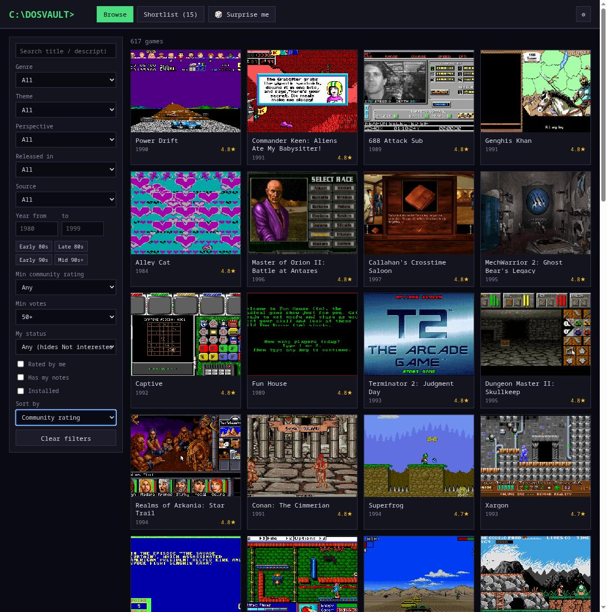
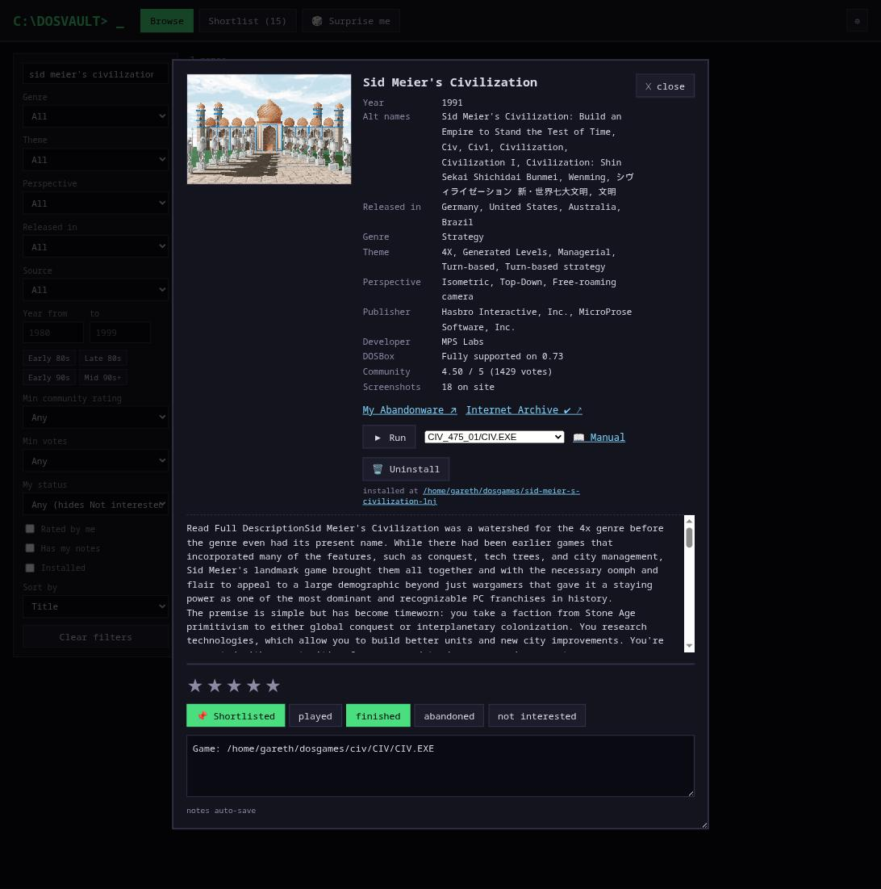
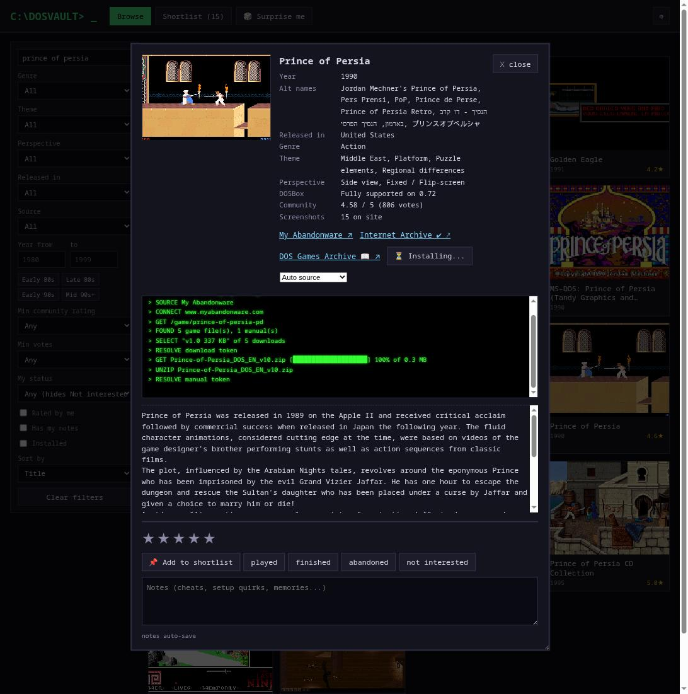
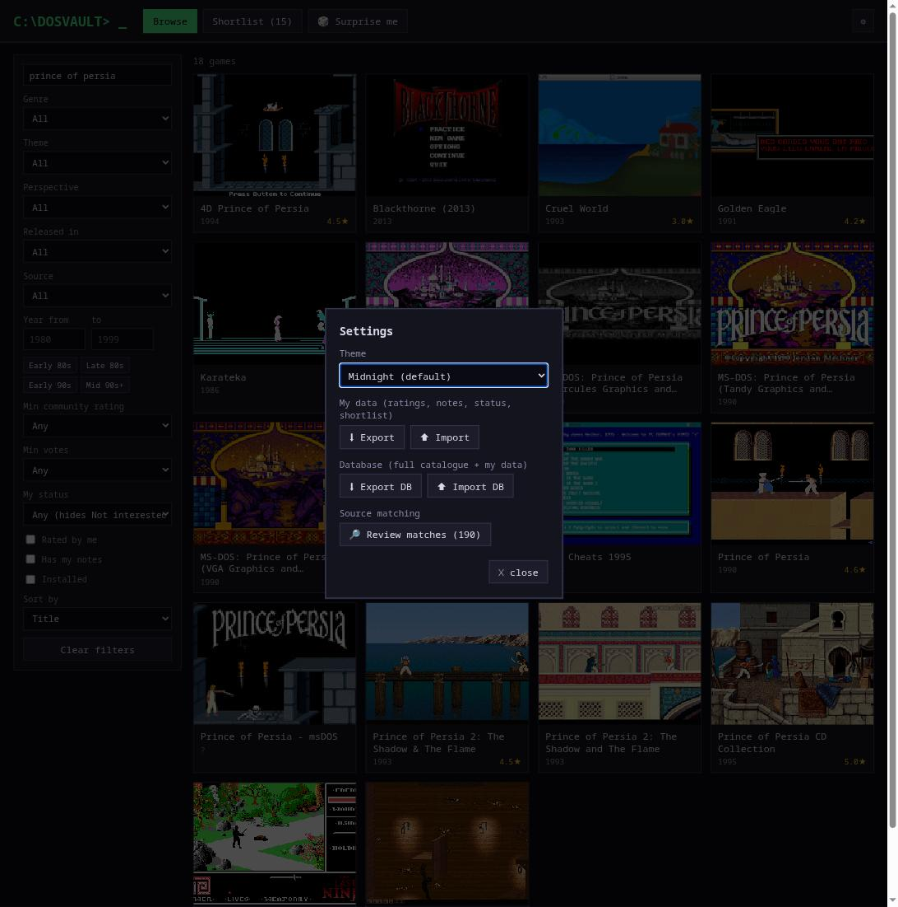
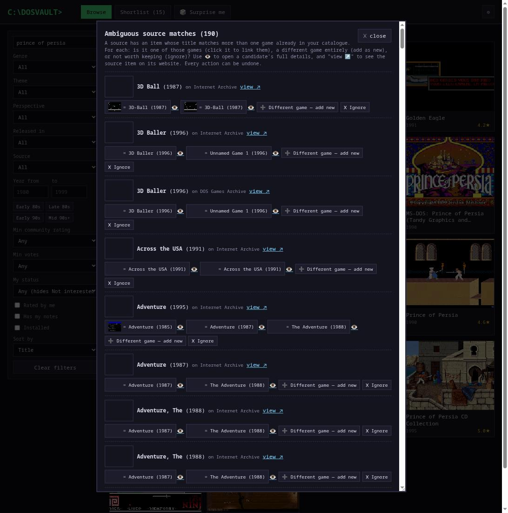
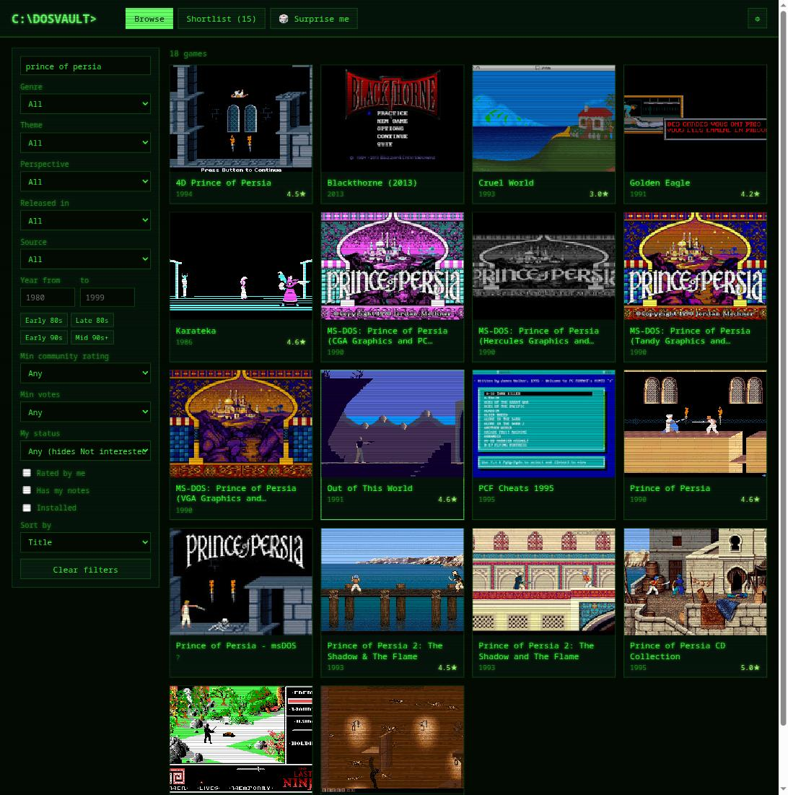

# Dos Vault

A local, searchable catalogue of DOS games drawn from multiple abandonware
sites (myabandonware.com, the Internet Archive, dosgamesarchive.com), with a
personal shortlist, 1-5 star ratings, play-status tracking, per-game notes,
and one-click install & run in DOSBox.

No build step: Node + Express + SQLite (better-sqlite3) on the server, vanilla
JS in the browser.



## Why this exists

The sites this app draws from already let you download games and even play
them in the browser. So what does a local app add? The same things a library
adds over a bookstore:

- **Your collection, not their site.** Ratings, notes, a prioritized
  shortlist, and played/finished/abandoned tracking, stored locally in one
  SQLite file and portable via export. No account, no ads.
- **One catalogue across silos.** The sources don't know about each other.
  This app searches and filters all of them at once, and can answer the
  question none of them can alone: *where can I actually get this game?*
- **Real DOSBox beats browser emulation.** In-browser play is fine for five
  minutes of nostalgia, but native DOSBox gives full speed, proper keyboard
  and sound, tweakable per-game config, and save files that live on your
  disk instead of inside a browser tab. If you intend to *finish* a long
  game, you want a local install.
- **Permanence.** Abandonware sites lose games whenever a publisher starts
  selling them again (hundreds of catalogue entries here already point at
  pages with no download left), and whole sites disappear. Your local catalogue, thumbnails, and installs survive all of that.
  When one source drops a game, the app knows which other source still
  has it.
- **Less friction.** One click resolves the site's download dance, picks the
  best release (highest version, English preferred), unzips it, puts the
  manual inside the game folder, and remembers which executable to launch.
- **Discovery.** Finishing a great game is exactly when you want another like
  it. The "Find similar" button turns a game's own genres, themes, and
  perspectives into live filters, best-rated matches first, and you can widen
  or narrow from there. Surprise-me picks a random game within whatever
  filters are set.

The websites are archives and storefronts; this is your shelf.

## Screenshots

**Game details:** metadata, per-source availability (✔ has the game, 📖
extras only), install/run/manual controls, and your rating, status, and notes:



**Installing:** a retro console streams each step live, download progress
bar included:



**Settings:** theme picker, two tiers of backup, and the source match
review queue:



**Review matches:** resolve items a sync couldn't uniquely match, with
thumbnails on both sides and undo on every action:



**Themes:** ten retro looks, here Green Phosphor with scanlines:



## Features

- Full-text search (title, alt names, description) with prefix matching.
- Filters: genre, theme, perspective (all multi-select), released-in country,
  source, year range (plus era
  quick-chips), min community rating, min vote count, my status, rated-by-me,
  has-notes, installed.
- Sort by title, year, community rating, vote count, or my rating.
- Game detail view with metadata, description, and a link to the game page.
- Install button: downloads the best DOS release from the site (highest version,
  English preferred), unzips it into your games folder, and drops any manuals
  (PDF/text) into the game's folder, with a live retro console showing progress.
- Run button: launches the game in DOSBox, remembering which executable you
  picked per game. A link opens the install folder in your file manager.
- CD-ROM games: installs containing a disc image (.iso, .cue/.bin) get it
  mounted automatically (`IMGMOUNT E:` with the game folder on D:), and
  executables found inside the ISO show in the run picker marked 💿 — run the
  CD's installer once, then the installed copy on D: appears in the picker.
  Multi-disc games mount all images (swap discs with Ctrl+F4 in DOSBox).
- Shortlist with drag-to-reorder priority.
- 1-5 star personal ratings and notes (auto-saved).
- Play status: played / finished / abandoned / not interested ("not interested"
  games are hidden from browsing unless you filter for them).
- Surprise me: random game respecting the current filters.
- Find similar: filters the catalogue to games sharing the current game's
  genre, theme, or perspective, best-rated first.
- 10 retro themes (settings ⚙), from Solarized to full green-phosphor CRT.
- Export / import of all your personal data (settings ⚙).

## Requirements

- Node.js 18.14+ (uses global `fetch`)
- To install/run games: an unzip tool, DOSBox, and a file manager
  (see Configuration; sensible per-platform defaults are built in)

## Quick start

```bash
npm install
npm run sync       # populate the catalogue from all sources (hours; resumable, see Sources)
npm start          # serve the app at http://localhost:3456
```

A fresh checkout has an empty catalogue: the `data/` directory (SQLite database
and thumbnails) is not committed. The UI is usable while the scrape runs; a
progress counter shows in the header.

## Configuration

If DOSBox is on your PATH, the defaults work with no configuration at all, on
any platform. Otherwise, copy the example that matches your setup to
`config.json` (gitignored) and adjust the paths:

```bash
cp config.example.linux.json config.json           # distro-packaged DOSBox
cp config.example.linux-flatpak.json config.json   # Flatpak DOSBox
cp config.example.macos.json config.json           # DOSBox.app bundle
cp config.example.windows.json config.json         # DOSBox under Program Files
```

Notes per platform:

- **Linux (Flatpak):** the games dir must be in the sandbox's filesystem
  permissions: `flatpak override --user --filesystem=~/dosgames com.dosbox.DOSBox`
- **macOS:** if DOSBox came from Homebrew it's on the PATH already, so no
  config is needed; the example is for the .app bundle download.
- **Windows:** archive extraction and folder opening use the built-in `tar`
  and `explorer`, so only the DOSBox path usually needs setting.
- **DOSBox Staging / DOSBox-X** users on any platform: set `"dosbox"` to
  `["dosbox-staging"]` / `["dosbox-x"]` (or the full path).
- **Linux:** listing executables inside CD images uses `isoinfo` (package
  `genisoimage` or `cdrtools`); `["bsdtar", "-tf", "{archive}"]` works as an
  `isoList` alternative. Without a working `isoList`, ISO games still mount
  and run — the picker just can't show the CD's contents.

All available keys, with their defaults:

| Key          | Default                                     | Meaning                                        |
| ------------ | ------------------------------------------- | ---------------------------------------------- |
| `port`       | `3456`                                      | HTTP port (env var `PORT` wins)                |
| `gamesDir`   | `~/dosgames`                                | Where games are installed, one folder per game |
| `dosbox`     | `["dosbox"]`                                | Base command to launch DOSBox; mount/exe args are appended |
| `unzip`      | `unzip -o {archive} -d {dest}` (`tar -xf {archive} -C {dest}` on Windows) | Archive extraction command |
| `unzipList`  | `unzip -Z1 {archive}` (`tar -tf {archive}` on Windows) | Lists archive entry paths, one per line |
| `isoList`    | `isoinfo -f -i {archive}` (`tar -tf {archive}` on Windows/macOS) | Lists file paths inside a CD image, one per line |
| `openFolder` | `xdg-open {dir}` / `open {dir}` (macOS) / `explorer {dir}` (Windows) | Opens a folder in the file manager |

Commands are given as argv arrays; `{archive}`, `{dest}`, and `{dir}` are
substituted at call time.

## Sources

The catalogue is a union of every synced source; all of them are peers. Sync
them all with one command, or individually:

```bash
npm run sync                     # everything below, in order (resumable, safe to re-run)

npm run sync:myabandonware       # myabandonware.com (~7,600 games; hours on first run)
npm run sync:archiveorg          # Internet Archive MS-DOS library (~8,900 items; minutes)
npm run sync:dosgamesarchive     # dosgamesarchive.com (~1,650 games; ~30 min)
```

Every sync is resumable: interrupt and re-run freely, already-handled items
are skipped. Each source contributes what it has: myabandonware brings the
deepest metadata (genres, themes, perspectives, descriptions, community
ratings) plus downloads; the others bring downloads, availability, and basic
metadata for games nowhere else in the catalogue.

Syncs match incoming items onto existing games by normalized title + year:
unique matches are linked in `game_sources`, items not in the catalogue at
all are added as new games (flagged with their origin), and ambiguous matches
are queued for manual review (Settings → Review matches), where you link,
add, or dismiss them. Every action can be undone.

The installer picks the best source automatically: sources known to lack the
game (sold-again titles that only offer a manual, or demo-only entries) rank
below sources with the real thing. A picker next to Install lets you choose
explicitly. Source adapters live in `sources/` (one file per site; the
contract is documented in `sources/myabandonware.js`).

Extras: `node thumbs.js` fetches thumbnails for any games missing a local
image (run it after a sync). The myabandonware sync also accepts
`--lists-only`, `--details-only`, and `--limit N` flags.

To retry games that previously errored:

```bash
node -e "require('./db').db.prepare('UPDATE games SET detail_scraped=0 WHERE detail_scraped=2').run()"
npm run sync:myabandonware
```

## Data

Everything lives in `data/app.db` (SQLite, WAL mode):

- `games`: the scraped catalogue. Re-scraping refreshes it.
- `user_data`: your ratings, notes, status, shortlist, install locations.
  A separate table, so re-scraping never touches it.

Settings (⚙) offers two levels of backup:

- **Export / Import**: a portable JSON of just your personal data (matched by
  game slug on import, so it survives a database rebuild on any machine).
- **Export DB / Import DB**: the entire SQLite database (catalogue + personal
  data), handy for moving to another machine without re-scraping. Importing
  replaces everything. Thumbnails are not included; run `node thumbs.js` to
  fetch them after moving.

## Project layout

```
server.js                Express API + static frontend hosting
sources/                 one adapter per site (contract in myabandonware.js)
sync-myabandonware.js    myabandonware.com sync: full-metadata crawler
sync-archiveorg.js       Internet Archive sync
sync-dosgamesarchive.js  dosgamesarchive.com sync
matching.js              shared title+year matcher used by the syncs
thumbs.js                standalone thumbnail downloader
db.js                    SQLite schema, migrations, FTS triggers
config.js                platform defaults + config.json overrides
public/                  frontend (vanilla JS, no build)
data/                    SQLite db + thumbnails (gitignored)
```

## Author

Gareth Stretton
